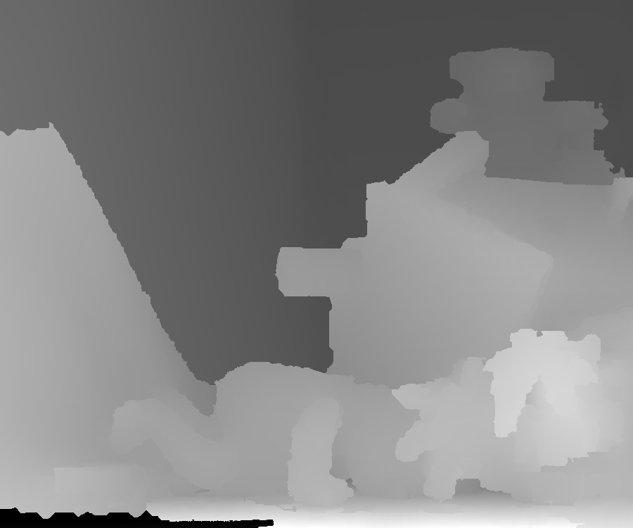
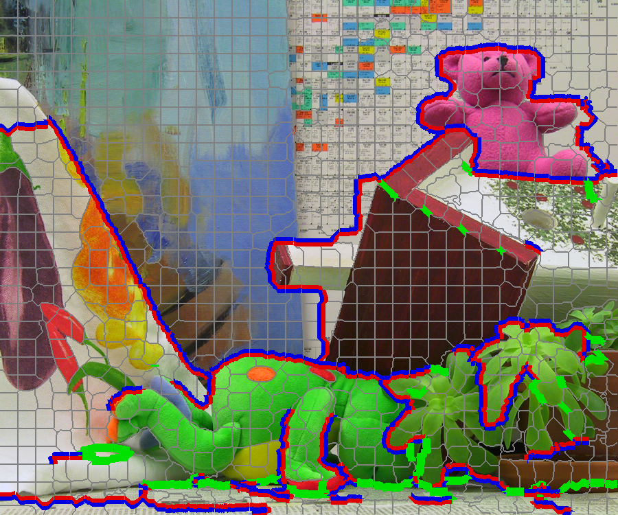
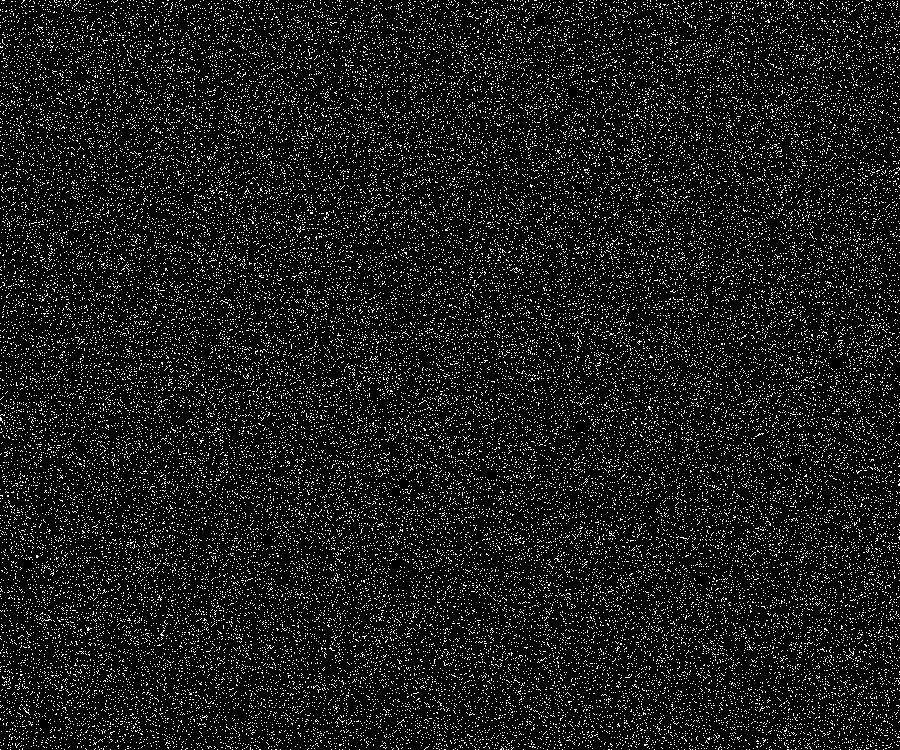

# Tutorial2020_Stereo_ROS: The Exercises on Recent Non-Learning Stereo Vision methods. Prepared for the Summer School 2020 at the [airlab][airlabss] in Carnegie Mellon University

[airlabss]: https://theairlab.org/summer2020

This repository contains the exercise code for the course of __Recent Advances of Binocular Stereo Vision__ held by the [airlab][airlabss] in Carnegie Mellon University as a part of the Summer School 2020. 

The course covers both recent non-learning and learning based methods. This repository contains the non-learning-based models discussed in the lecture. The learning-based models can be found [here](https://github.com/huyaoyu/Tutorial2020_Stereo).

# Methods

This exersice code presents two non-learning methods for passive binocular stereo vision, namely, the SPS-Stereo [[1]](#SPSStereo) and sparsely guided stereo method [[2]](#SparseGuided). Some custimizations are made to the source code released by the original authors to make the user interfaces consistent for the exercise.

## SPS-Stereo

SPS-Stereo takes the disparity predictoion from a the SGM method, then fits plane segments over the initial disparity. The boundaries of the fitted plane segments are smoothed by potimizing the type and position of the boundary pixels. The optimiation process runs several rounds. After the plane segmentation, the disparity of a pixel is compuated by first finding the associated plane segment of the pixel and then interpolate the dispapirty value inside the plane segment it belongs to.

The original source code can be found [here](https://github.com/siposcsaba89/sps-stereo). ALL RIGHTS RESERVED TO THE ORIGINAL AUTHORS.

## Sparsely guided stereo method

This method takes a sparse depth measurement as a guidence then modify the cost values computed in the SGM process. The sparse depth measurement can be obtained by using a LiDAR sensor. 

The original work provides 3 types of fusion between SGM and the sparse measurement. All of the fusion happen after the computatoin of the stereo matching cost. Then the matching cost will be updated with respect to the sparse measurement. The 3 types of upate are

1. Directly change the matching cost of a pixel at disparity `d` if the pixel has a corresponding depth measurement.
2. Change the matching cost of the current pixel if there is a measurement at this pixel. Then update the neighoring pixel inside tha window size.
3. Weigted interpolation of the sparse measurement to maximize the effective region.

The original source code can be found [here]([https://](https://github.com/ShreyasSkandanS/stereo_sparse_depth_fusion)). ALL RIGHTS RESERVED TO THE ORIGINAL AUTHORS.

# System set up

## Base system

At least Ubuntu 16.04, Ubuntu 18.04 recommended. Ubuntu with a common C++ build system. Install these common packages system-wide:

```bash
sudo apt-get install build-essential git libsm6 libxext6 virtualenv libboost-all-dev zlib1g-dev lsb-release cmake libpng++
```

A desktop-full version of ROS compatible with the Ubuntu base system. Python3 support for ROS is not required. Please set up a separated catkin workspace.

## Additional software

[CloudCompare](https://snapcraft.io/cloudcompare).

# Video

Coming soon, stay tuned.

# Exercise

## Building the code

Create a directory for a temporary catkin workspace. Let’s call this directory `<ws>`. 

```bash
cd <ws>
```

Clone the current repo.

```bash
git clone https://github.com/huyaoyu/Tutorial2020_Stereo_ROS.git src
```

Now the catkin workspace looks like this: `<ws>/src`. We are now in `<ws>`. Use the following command to configure Eigen3. The sample code needs the latest Eigen3 to be able to compile approriately. This configuration script only installs Eigen3 to a specific location (`<ws>/ThirdParties`) and will NOT affect the system default Eigen3 if there is any.

```bash
cd src && ./ConfigureThirdParties.sh && cd .. && catkin build && source devel/setup.bash
```

## Structure of the samples

If the build process ends successfully, then we could test the sample cases. The structure of `<ws>/src` is listed as follows. 

```
.
├── CMakeLists.txt
├── ConfigureEigen.sh
├── SampleData
├── sps-stereo
├── stereo_sparse_depth_fusion
└── stereo_utils
```

There are two sample stereo reconstruction codes saved in `sps-stereo` and `stereo_sparse_depth_fusion` directories. And the sample input files are saved in `SampleData`. The ROS and the catkin system is only used for building purpose and they make the building process easier to be carried out. The sample code will not use any ROS specific functionalities.

## SPS-Stereo

To test sps-stereo, first go to the src directory of sps-stereo package. It is assumed that we are still in the `<ws>` directory.

```bash
cd src/sps-stereo/src
```

To run the sample code, use the following command.

```bash
./LocalRun.sh
```

LocalRun.sh invokes the executable of sps-stereo package and processes all the sample stere images listed in the `Cases.json` file which is located besides `LocalRun.sh`. All results are saved to the directory `<ws>/src/sps-stereo/results`.

For sps-stereo, there is a tunable parameter stored in the `Cases.json` file which controls the total number of initial plane segments. The parameter is `superpixelTotal`. The user can vary this parameter to see the differences in the results.

The user could check out the content of `<ws>/src/sps-stereo/results` and visualize the disparity maps. There will be a point cloud saved to the subfolder of a stereo test case if the camera extrinsics are provided as input. E.g., sample case `<ws>/src/SampleData/Middlebury_E3/TeddyH` has its extrinsics saved as the `Q.data` file. sps-stereo produces a point cloud based on the predicted disparity and camera extrinsics. The point cloud is saved to `<ws>/src/sps-stereo/results/ME_TeddyH/Cloud.ply`. The user could visualize the PLY file by the CloudCompare software.

A sample disparity map for the "Teddy" case from the Middlebury Evaluation V3 dataset is shown in the following figure.



The associated plane segmentation is as follows.



where boundaries between segments are classified by colors: gray->co-planar, green->hinge, red and blue->occlusion.

## stereo_sparse_depth_fusion

The second sample project is stereo_sparse_depth_fusion. The way to run the executable is similar to sps-stereo.

```bash
cd <ws>/src/stereo_sparse_depth_fusion/src
./LocalRun.sh
```

The executable also reads a `Cases.json` file and processes all the stereo test cases listed in the JSON file. 

There is also a tunable parameter stored in `Cases.json` file for each test sample. It is `gtSampleFrac` which controls the ratio of ground truth data to be sampled as the sparse measurement.

The following image shows the disparty prediction of the same "Tedddy" case used in the sps-stereo exercise and a `gtSampleFrac` value of 0.1. The fusion method is the anisotropic diffusion.


<!-- And the follows is the sampled positions.

 -->

# References

<a id="SPSStereo">[1]</a> Yamaguchi, Koichiro, David McAllester, and Raquel Urtasun. "Efficient joint segmentation, occlusion labeling, stereo and flow estimation." In European Conference on Computer Vision, pp. 756-771. Springer, Cham, 2014.

<a id="SparseGuided">[2]</a> Shivakumar, Shreyas S., Kartik Mohta, Bernd Pfrommer, Vijay Kumar, and Camillo J. Taylor. "Real time dense depth estimation by fusing stereo with sparse depth measurements." In 2019 International Conference on Robotics and Automation (ICRA), pp. 6482-6488. IEEE, 2019.